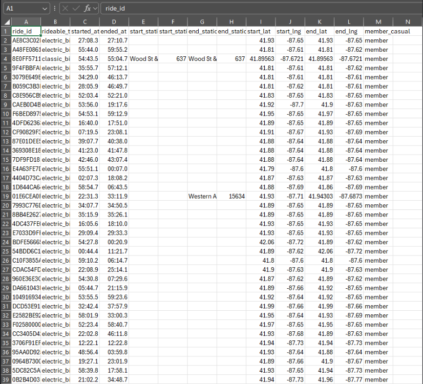
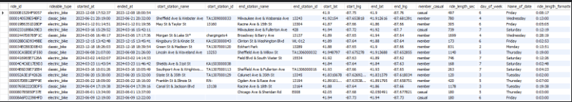
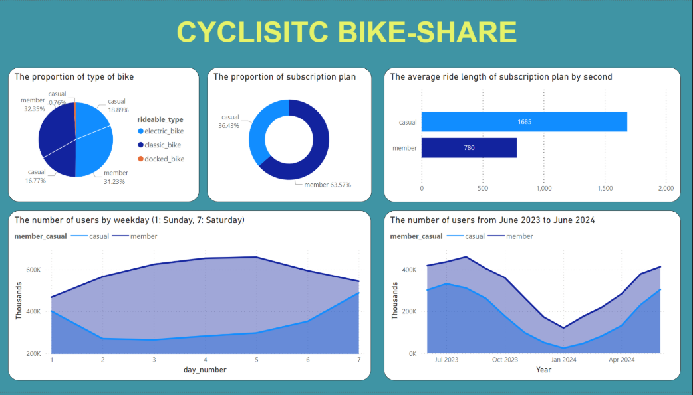
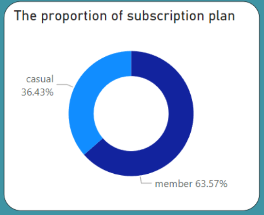
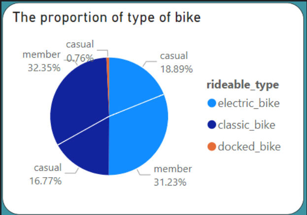
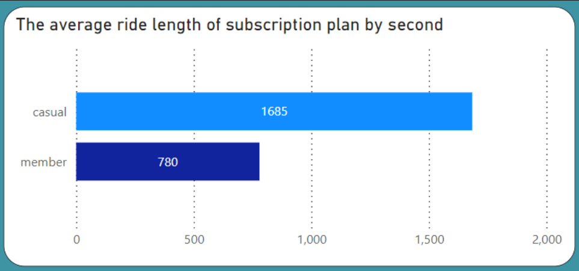
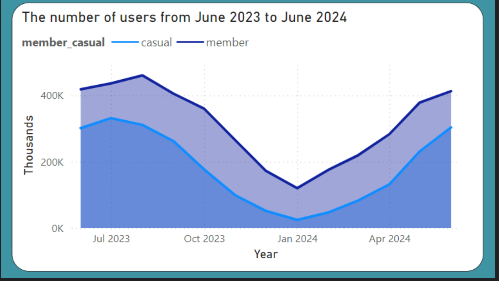
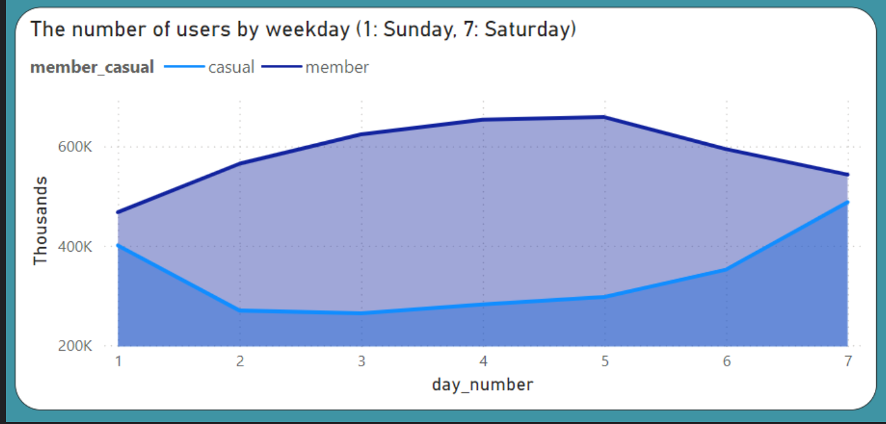
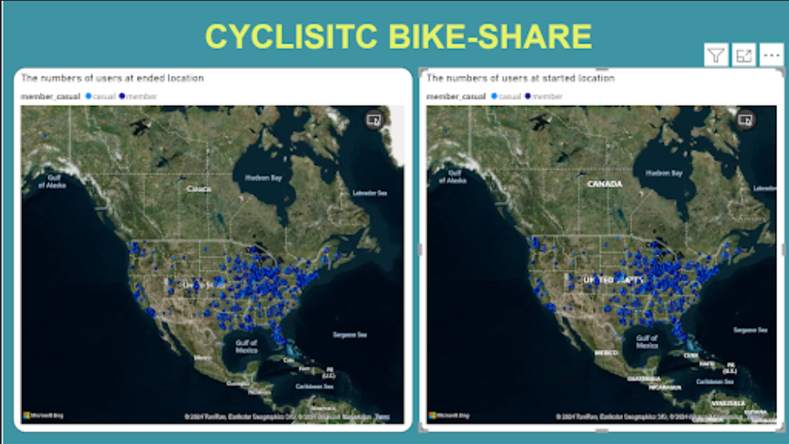

# 1. ABOUT THE COMPANY

In 2016, Cyclistic launched a successful bike-share program in Chicago, which has grown to include 5,824 geotracked bicycles across 692 stations. The bikes can be unlocked from one station and returned to any other within the system. Cyclistic’s marketing strategy has primarily focused on building general awareness and appealing to broad consumer segments, aided by flexible pricing plans: single-ride passes, full-day passes, and annual memberships. Customers who purchase single-ride or full-day passes are known as casual riders, while those with annual memberships are Cyclistic members.

**Problem:** Financial analysis shows that annual members are significantly more profitable than casual riders. To drive future growth, Cyclistic aims to convert casual riders into annual members. This approach leverages the existing awareness and usage of Cyclistic by casual riders.

**Business Goal:** The goal is to design marketing strategies specifically targeting this conversion. The team plans to analyze historical bike trip data to understand the differences between annual members and casual riders, the motivations for casual riders to become members, and the role of digital media in their marketing tactics.

# 2. DELIVERABLES
- A clear statement of the business task
- A description of all data sources used
- Documentation of any cleaning or manipulation of data
- A summary of my analysis
- Supporting visualizations and key findings
- My top four recommendations based on your analysis

# 3. ASK
Design marketing strategies aimed at converting casual riders into annual members. 3 key questions for marketing program to fulfill the goal:

- How do annual members and casual riders use Cyclistic bikes differently?
- Why would casual riders buy Cyclistic annual memberships?
How can Cyclistic use digital media to influence casual riders to become members?

# 4. PREPARE
Data is downloaded from [here](https://divvy-tripdata.s3.amazonaws.com/index.html). Cyclistic is a fictional company under the [data license](https://divvybikes.com/data-license-agreement). The datasets are used from 2023-06 to 2024-06. I stored these datasets in Case-study folder which helps to organize the data more visible. This is 2024-06 bike trip dataset:



The table consists of 13 columns with information about customer’ usage to bike-share service I notice that many null values/information exist, I need to take time to process data in Excel before importing into SQL to analyze

# 5. PROCESS
Tool to clean and format the data would be Microsoft Excel, then it is imported to database in MySQL. For further analysis, SQL is used to combine relevant data into 1 table. It helps the centralization of data, easier for later analysis.

**Format process:**

1. Change the format of started_at and ended_at to Date
2. Change the format of start_lat, start_lng, end_lat, end_lng to Numbers

**Manipulate process:**

1. Add ride_length column: subtract the column started_at from the column ended_at, then change the format to h:mm:ss
2. Add day_of_week column: use command =WEEKDAY(C2,1) (1 = Sunday and 7 = Saturday)
3. To better interpretation, i added the column Name of date to perform specific date name, command: =TEXT(O2,"dddd")

I do the same for other 11 months files. Because each file has many rows (around 700000 per file), it will overload when I use Excel to combine and analyze it. Therefore, I decided to use SQL to query and analyze the dataset. First of all, I will import these files into MySQL workbench. I created a database which store 12 months csv files:

My code:

```
CREATE DATABASE cyclistic;
```
Next, I created the table which store the dataset from csv file

My code:
```
CREATE TABLE `trip_data` (
    ride_id VARCHAR(255) PRIMARY KEY,
    rideable_type VARCHAR(255),
    started_at DATETIME,
    ended_at DATETIME,
    start_station_name VARCHAR(255),
    start_station_id INT,
    end_station_name VARCHAR(255),
    end_station_id INT,
    start_lat DOUBLE,
    start_lng DOUBLE,
    end_lat DOUBLE,
    end_lng DOUBLE,
    member_casual VARCHAR(255),
    ride_length VARCHAR(255),
    day_of_week INT,
    Name_of_date VARCHAR(255)
);
```

Then i will load the dataset into that table. As usual, I load my data into MySQL using the Data Import Wizard. However, the dataset is very huge and it took a lot of time to be fully loaded. Therefore, I use LOAD DATA INFILE to import dataset fastly.

My code:

-- load data into table by data load infile with 12 csv files
```
LOAD DATA INFILE 'C:/ProgramData/MySQL/MySQL Server 8.0/Uploads/202401-divvy-tripdata.csv' INTO TABLE `trip_data`
FIELDS TERMINATED BY ','
OPTIONALLY ENCLOSED BY '"'
LINES TERMINATED by '\n'
IGNORE 1 LINES
(ride_id, rideable_type,
    started_at ,
    ended_at ,
    start_station_name ,
    start_station_id,
    end_station_name ,
    end_station_id ,
     @start_lat,
     @start_lng,
     @end_lat,
     @end_lng,
     member_casual,
     @ride_length,
     day_of_week,
     Name_of_date)
SET
 start_lat = NULLIF(@start_lat, ''),
 start_lng = NULLIF(@start_lng, ''),
 end_lat = NULLIF(@end_lat, ''),
 end_lng = NULLIF(@end_lng, ''),
 ride_length = NULLIF(@ride_length, '');
```

-- I checked by below command but it had a error: the limitation of time datatype is 838:59:59 but my dataset is exceeding that number

```
SELECT ended_at, started_at, ride_length_sec, timediff(ended_at, started_at), sec_to_time(ride_length_sec)
FROM `trip_data`
ORDER BY ride_length_sec DESC
LIMIT 10;
```

-- because hh:mm:ss format is exceeding SQL required, i need to change into second of ride_length

```
UPDATE `trip_data`
SET ride_length = TIMESTAMPDIFF(SECOND, started_at, ended_at);
```

-- then I altered the ride_length_sec into time by manually formatting

-- (1) creating a new column

```
ALTER TABLE `2024_06_trip` ADD COLUMN ride_length_formatted varchar(255);
```

-- (2) add data of new column

```
UPDATE `trip_data`
SET ride_length_formatted = CONCAT(
           FLOOR(ride_length / 3600), ':',
           LPAD(FLOOR((ride_length % 3600) / 60), 2, '0'), ':',
           LPAD(ride_length % 60, 2, '0')
       );
```

– finally, check again to make sure all dataset is fine

```
SELECT *
FROM trip_data;
The result:
```


# 6. ANALYZE AND SHARE

**Main questions:**

1. How do annual members and casual riders use Cyclistic bikes differently?
2. Why would casual riders buy Cyclistic annual memberships?
3. How can Cyclistic use digital media to influence casual riders to become members?

**There has 2 ways to increase company revenue:**

- Increase the number of users including casual and member subscription
- Convert the casual riders into annual members

Because the clear has set before: Design marketing strategies aimed at converting casual riders into annual members. This proposal focuses on the second approach
Because the dataset is stored in database, I prefer using Power Bi over Tableau beacause its convenience in connecting directly with database.

The dashboards:


*(Picture 1)*

In next part, I will analyze each graph individually to showcase the interesting insight. 


*(Picture 2)*

In picture 2, the proportion of member subscriptions is as nearly twice as casual riders, I conclude that member users use bikes more frequently than casual members.


*(Picture 3)*

I would find which type of bike casual and member riders prefer. Overall, classic bike and electric bike are ridden at nearly the same proportion with 49% and 50% correspondingly. People hardly use docked bike with below 1%.
In the bar chart, we can observe that there is no significant difference in bike type among users’ preference.


*(Picture 4)*

Picture 4 displays the average ride length between casual and annual users by second. Even though the frequency of utilizing bike on casual users are not as much as annual member; on average, casual riders use the bike two times longer than member subscription. Consequently, I came up with conclusion about customer behavior that a casual user use bicycle from Cyclistic less than a annual subscriber but everytime he/she rides company’s bike, they use it much longer than the other


*(Picture 5)*

When I observe the usage of bikes between two kinds of subscription over a year from June 2023 to June 2024, I see the similarity in the frequency they use bikes. From June to October 2023, company bike usage increases both 2 subscription plan, its peak in this period is in August 2023 at approximately 450.000 bike usage in this month. 
However, it witnesses the continuous decrease in the last months of 2023 and first months of 2024. In January 2024, the number of users reached the lowest point within a year. Subsequently, the number of riders gradually increased in the following months; seemingly, it would reach its own peak from June to October 2024.
Because the dataset is just displayed within a year, to give more specific insight and analysis I still need more data to illustrate the trend of customer behavior.


*(Picture 6)*

In this picture, I could see the significant difference between casual and annual users. The casual riders tend to ride bikes on the weekend (Saturday and Sunday). Meanwhile, annual members mostly use company bikes on weekdays, from Monday to Friday. On weekends, the number of annual riders slightly decreases. Based on data collected and visualized from this graph, I assume that people subscribe to annual members because their major usage is for commuting to work. On the other hand, bikes ridden by casual riders are mostly used for leisure at weekends. 


*(Picture 7)*

Lastly, in picture 7, The start and end location are dispersed throughout the USA. However, the number of riders mostly distribute to the eastern area and western coastal area such as California and Washington in the United States. 

# INSIGHT AND ACT

1. Company’s biking service are widely used in western area and near the sea where many large cities are located such as Los Angeles, San Francisco, San Diego. Cyclistic should focus on improving facilities and services in these areas. Launching more campaigns to potential locations would increase the brand identity and target customers to use company service.

2. Casual users ride bikes less frequently than annual subscribers but those average ride length are longer than the other’s average ride length. This indicates that casual users enjoy their rides and spend more time on each trip, suggesting they could benefit from a membership that encourages more frequent usage and offers better value. Moreover, emphasize the exclusive benefits for annual members, such as discounts, free ride minutes, and priority access to bikes during peak hours.

3. During the summer months (June to August 2023, warmer weather and longer days encourage more people to use bikes both casual and annual members. In contrast, winter months (December 2023 to February 2024) may discourage bike riding due to colder weather and shorter days. Campaigns such as promotions and discounts to convert casual riders into annual members should be launched on the peak summer seasons. It helps the probability of conversion gets higher and marketing campaigns are easier to succeed

4. To attract more annual members from casual riders, the company should boost the casual users’ engagement. Capitalize on the high midweek usage by organizing special promotions, events, and incentives for both casual and annual members, especially the target customer (casual riders). This could include weekday challenges, group rides, and midweek discounts to further boost engagement. Moreover, the marketing campaigns will also consider to shift users’ behavior from using bikes primarily for weekend leisure activities to adopting them as a main mode of transportation for commuting to the workplace 
